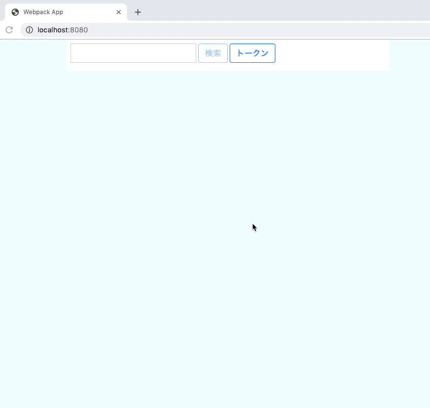

# search-github-repo
Githubリポジトリの検索UI

# usage
```html
<div id='app'></div>
<script type="text/javascript" src="./dist/search-github-repo.js"></script>
<script>
  window.onload = function() {
    renderSearchRepo('app', {
      onClickLink: function(href) {
        alert(href);
      },
      lang: 'js',
      repo: 'jquery/jquery',
    });
  };
</script>
```

# sample

